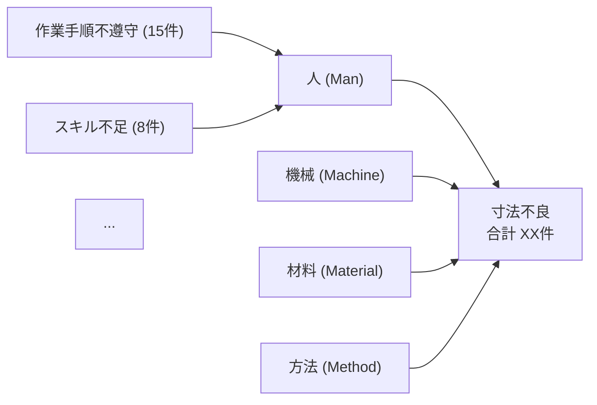

# 特性要因図（フィッシュボーン）生成スキル

## トリガー
以下のキーワードで起動:
- 「特性要因図を作成して」「フィッシュボーン図を生成」「石川ダイアグラム」
- 「不良の原因をフィッシュボーンで分析」「4M分析」
- 「ishikawa」「fishbone」

## 入力
品質管理アプリの「データ出力」タブ→「分析用JSONコピー」で出力したJSONデータ。
ユーザーがクリップボードからペースト、またはJSONファイルを指定する。

### JSONデータ形式
```json
{
  "exportedAt": "2026-02-27T...",
  "totalRecords": 220,
  "records": [
    {
      "id": 1,
      "date": "2026-02-20",
      "product": "製品A",
      "process": "加工",
      "defectType": "寸法不良",
      "severity": "重度",
      "quantity": 3,
      "rootCause": "設備劣化",
      "rootCause4M": "機械",
      "status": "完了"
    }
  ]
}
```

## 実行手順

### Step 1: データ読込と対象特定
1. ユーザーから提供されたJSONデータを読み込む
2. 対象とする不良種別や製品を確認（指定がなければ最多不良種別を自動選択）
3. 対象データをフィルタリング

### Step 2: 4M分類で原因を集計
データの`rootCause4M`フィールドを使い、以下の4カテゴリに分類:

| 4M分類 | 日本語 | 分析対象 |
|--------|--------|----------|
| Man (人) | 人 | 作業者のスキル、注意力、手順遵守 |
| Machine (機械) | 機械 | 設備状態、治工具、校正 |
| Material (材料) | 材料 | 材料品質、ロット差、保管 |
| Method (方法) | 方法 | 作業手順書、検査基準、工程設計 |

各カテゴリ内で原因を出現頻度順にランク付けする。

### Step 3: フィッシュボーン構造の構築
```
                                ┌─ 原因1 (N件)
                    ┌── 人 ────┤
                    │           └─ 原因2 (N件)
                    │
                    │           ┌─ 原因3 (N件)
[対象不良] ←────────┤── 機械 ──┤
                    │           └─ 原因4 (N件)
                    │
                    │           ┌─ 原因5 (N件)
                    ├── 材料 ──┤
                    │           └─ 原因6 (N件)
                    │
                    │           ┌─ 原因7 (N件)
                    └── 方法 ──┤
                                └─ 原因8 (N件)
```

### Step 4: 出力

**Miroボードへの出力（推奨）**:
OpsFlowスキルと同様のMiro MCP連携を使い、フィッシュボーン図をMiroボードに生成する。
- 中央に「問題（不良種別名）」を配置
- 4本の大骨を4M分類で配置
- 各大骨から小骨として個別原因を配置
- 頻度に応じてフォントサイズや色を変える

**テキスト出力（フォールバック）**:
Miro連携がない場合、以下のMermaid記法で出力:



### Step 5: 分析サマリー

出力にはフィッシュボーン図に加えて以下のサマリーを添付:

```
## 特性要因図 分析サマリー

### 対象
- 不良種別: 寸法不良
- 対象期間: 2025/09/01 〜 2026/02/27
- 総件数: XX件

### 4M別 原因ランキング
1. **機械 (Machine)**: XX件 (XX%) - 設備劣化が最多
2. **人 (Man)**: XX件 (XX%) - 作業手順不遵守が最多
3. **方法 (Method)**: XX件 (XX%)
4. **材料 (Material)**: XX件 (XX%)

### 重点対策ポイント
- 最も影響が大きい4M分類: [自動判定]
- 上位3原因に対する推奨アクション:
  1. [原因] → [推奨対策]
  2. [原因] → [推奨対策]
  3. [原因] → [推奨対策]
```

## 推奨対策テンプレート

4Mカテゴリ別の一般的な対策テンプレート:

### 人 (Man)
- 作業手順不遵守 → 作業手順書の見直し、教育訓練の実施、チェックリスト導入
- スキル不足 → OJT強化、力量評価表の整備、資格制度導入
- 注意力低下 → 作業環境改善、休憩時間の見直し、ポカヨケ導入

### 機械 (Machine)
- 設備劣化 → 予防保全計画の策定、定期点検の強化
- 治工具不良 → 治工具管理台帳の整備、定期交換基準の設定
- 校正ずれ → 校正頻度の見直し、校正手順書の作成

### 材料 (Material)
- 材料不良 → 受入検査の強化、サプライヤ評価の実施
- ロット差異 → ロット管理の徹底、抜取検査の増強
- 保管条件不良 → 保管基準の明確化、温湿度管理の導入

### 方法 (Method)
- 作業手順書不備 → 手順書の改訂、写真付き手順書への変更
- 検査基準不明確 → 検査基準書の見直し、限度見本の整備

## 注意事項
- `rootCause4M`が空のレコードは「未分類」として扱い、分析サマリーに注記する
- 記録数が10件未満の場合は「サンプル数不足のため参考値」と明記する
- 原因がないレコードは件数には含めるが、フィッシュボーン図には含めない
